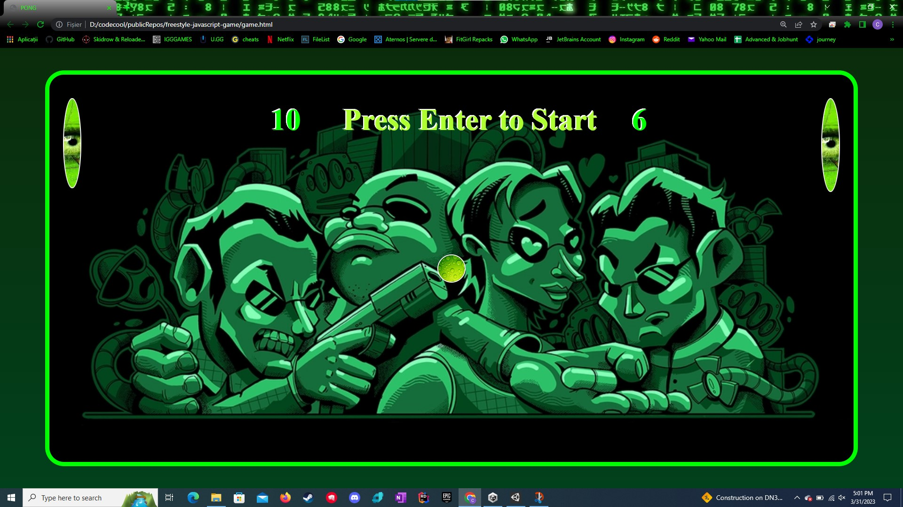

## freestyle-javascript-game

### About the Project:

- The purpose of this project is to create a modern version of the classic Pong game, adding power-ups and debuffs to make the gameplay more dynamic and challenging. With customizable graphics and sound effects, this game aims to provide a fun and engaging experience for players of all ages and skill levels.

- This project aims to recreate the retro arcade game Pong using modern web technologies, such as JavaScript, HTML, and CSS. By incorporating power-ups and debuffs, the game becomes more than just a simple back-and-forth between two paddles and a ball, keeping players on their toes and providing a fresh take on a classic game.

### Used technologies:
1. [JavaScript](https://en.wikipedia.org/wiki/JavaScript)
2. [HTML](https://en.wikipedia.org/wiki/HTML)
3. [CSS](https://en.wikipedia.org/wiki/CSS)

### Project Features:
- Classic Pong gameplay with two paddles and a ball
- Power-ups that appear randomly over time, such as a bigger paddle or faster ball
- Debuffs that appear randomly over time, such as a smaller paddle or slower ball
- A scoring system to keep track of the players' scores

### How to Run the Project?
- Clone the [Repo](https://github.com/CodecoolGlobal/freestyle-javascript-game.git).
- Run game.html

