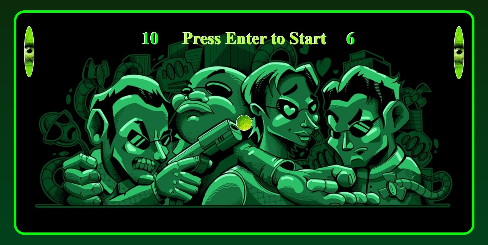

## freestyle-javascript-game

### About the Project:

- This project seeks to bring the classic Pong game to modern audiences using cutting-edge web technologies like JavaScript, HTML, and CSS.

- To enhance the gameplay, the project will incorporate various power-ups and debuffs to add an extra layer of excitement and challenge to the game. Debuffs such as ball speed up and paddle smaller will increase the difficulty level, while power-ups such as ball size up and paddle larger will make the game easier to play. These power-ups and debuffs will be randomly generated throughout the game to keep the player on their toes and ensure a fresh experience with each playthrough.

- With its mix of classic gameplay and modern twists, this project will appeal to both retro gaming enthusiasts and casual gamers alike. By using JavaScript, HTML, and CSS, this project will deliver a seamless and intuitive gaming experience on any modern web browser.

### Used technologies:
1. [JavaScript](https://en.wikipedia.org/wiki/JavaScript)
2. [HTML](https://en.wikipedia.org/wiki/HTML)
3. [CSS](https://en.wikipedia.org/wiki/CSS)

### Project Features:
- Classic Pong gameplay with two paddles and a ball
- Power-ups that appear randomly over time, such as a bigger paddle or faster ball
- Debuffs that appear randomly over time, such as a smaller paddle or slower ball
- A scoring system to keep track of the players' scores

### How to Run the Project?
- Clone the [Repo](https://github.com/CodecoolGlobal/freestyle-javascript-game.git).
- Run game.html

